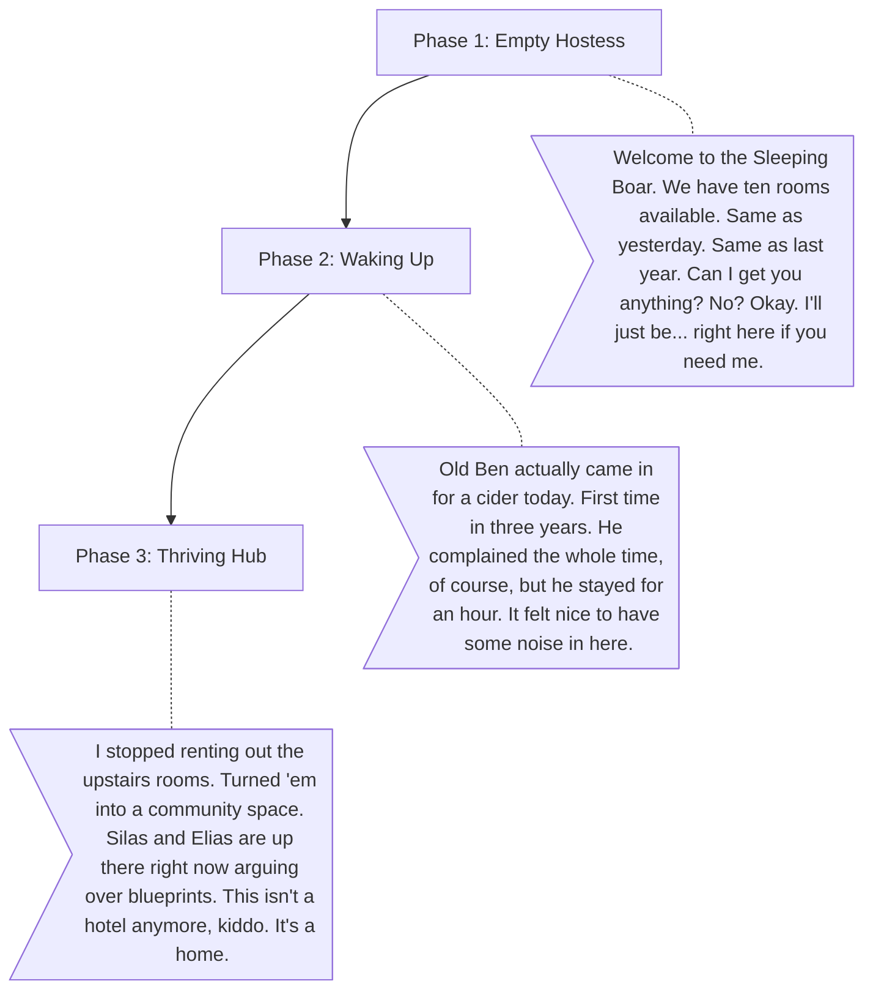

# Clara (The Inn Owner)

**The Wound:** She runs an empty inn. She feels like a ghost hostess.
**The Arc:** Moving from hosting "customers" to hosting a "community."

## Dialogue Flow

```mermaid
graph TD
    Phase1[Phase 1: Empty Hostess] --> Phase2[Phase 2: Waking Up]
    Phase2 --> Phase3[Phase 3: Thriving Hub]

    Q1>"""Welcome to the Sleeping Boar. We have ten rooms available. Same as yesterday. Same as last year. Can I get you anything? No? Okay. I'll just be... right here if you need me."""]
    Phase1 -.- Q1

    Q2>"""Old Ben actually came in for a cider today. First time in three years. He complained the whole time, of course, but he stayed for an hour. It felt nice to have some noise in here."""]
    Phase2 -.- Q2

    Q3>"""I stopped renting out the upstairs rooms. Turned 'em into a community space. Silas and Elias are up there right now arguing over blueprints. This isn't a hotel anymore, kiddo. It's a home."""]
    Phase3 -.- Q3
```
