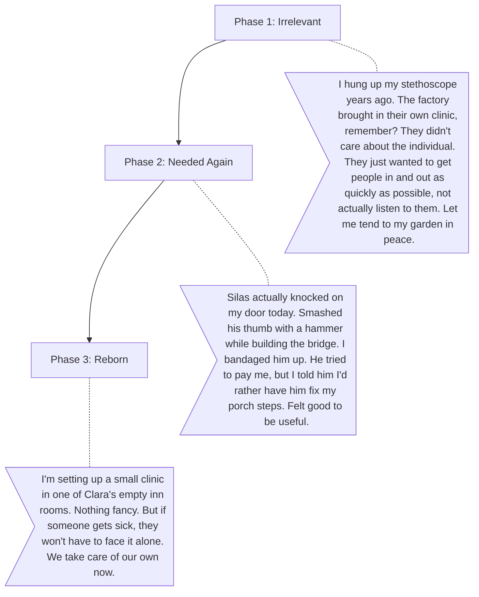

# Dr. Vance (The Retired Doctor)

**The Wound:** The factory brought in its own clinic, so he retired feeling obsolete. Now the town is too proud to ask him for help.
**The Arc:** Realizing that a community doctor's real job is about listening and holistic care, unlike the corporate clinic.

## Dialogue Flow

