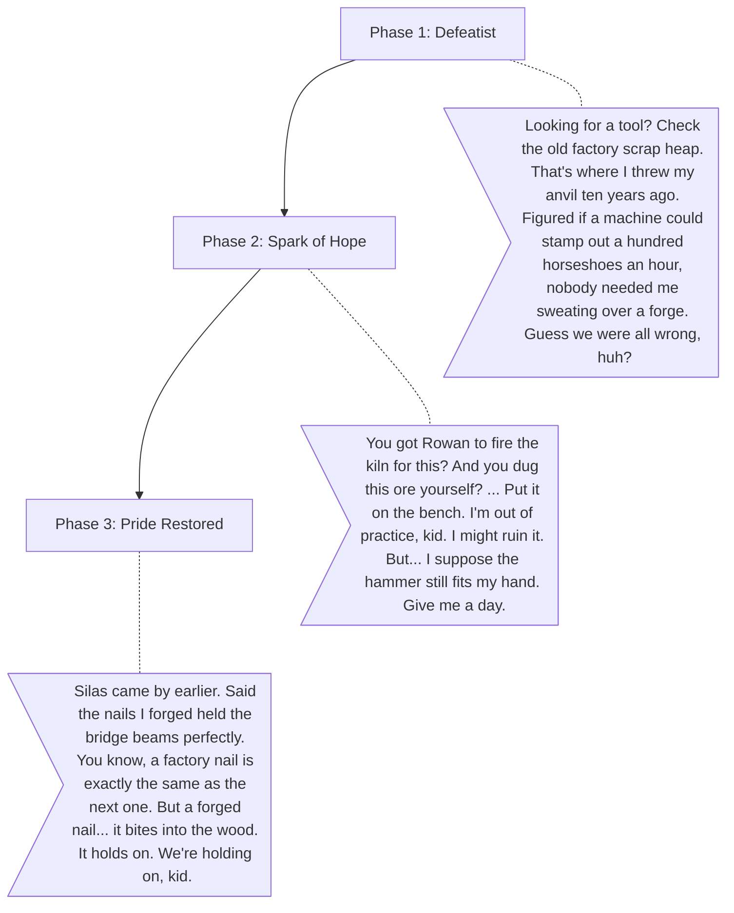

# Elias (The Blacksmith)

**The Wound:** He feels like a sellout. He abandoned his family's craft for easy factory money, and now he has neither.
**The Arc:** Reclaiming his pride and realizing his artisanal skills are still needed in a modern world.

## Dialogue Flow

