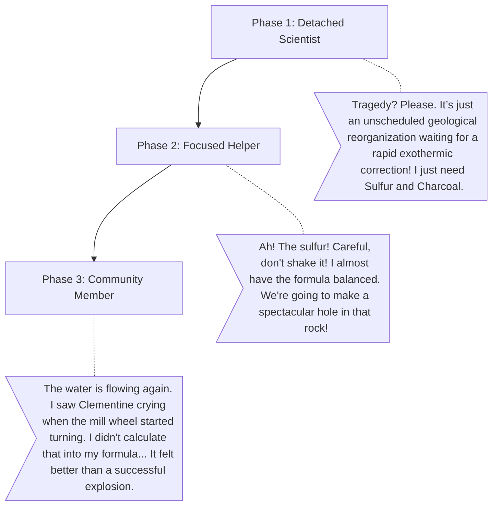

# Hazel (The Alchemist)

**The Wound:** She views everything as a fascinating scientific puzzle, detaching herself from the emotional reality of the town's struggle.
**The Arc:** Learning that people aren't variables in an equation, and that her scientific skills have a real human impact.

## Dialogue Flow

