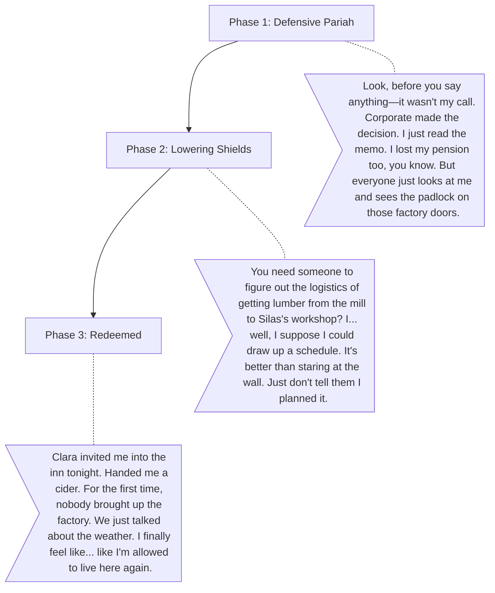

# Marcus (The Ex-Manager)

**The Wound:** He was the middle manager at the factory. He didn't make the decision to close it, he just had to deliver the news. The town treats him like a villain.
**The Arc:** Moving from a defensive pariah to a trusted community member who realizes his organizational skills can help people rebuild.

## Dialogue Flow

