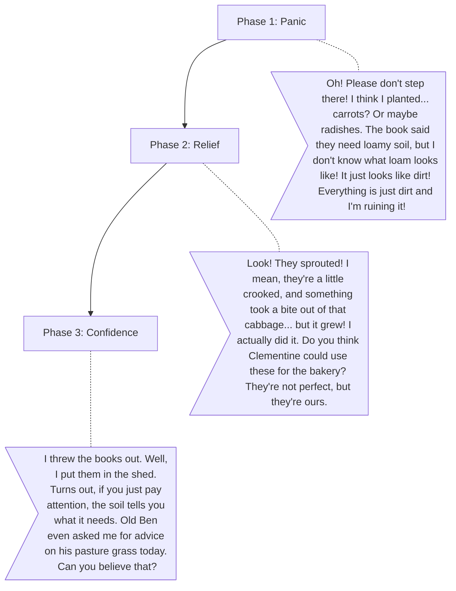

# Millie (The Overwhelmed Beginner)

**The Wound:** Imposter syndrome. She feels the weight of her family's farming legacy but lacks practical experience.
**The Arc:** Moving from relying on textbooks to trusting her instincts and the land.

## Dialogue Flow

