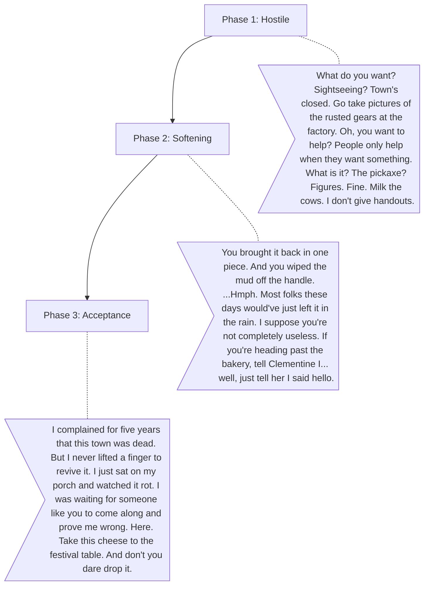

# Old Ben (The Stubborn Gatekeeper)

**The Wound:** He feels abandoned by the younger generation who all went to work at the factory. He uses gruffness as a shield against loneliness.
**The Arc:** Admitting he is lonely and accepting that the new generation cares.

## Dialogue Flow

