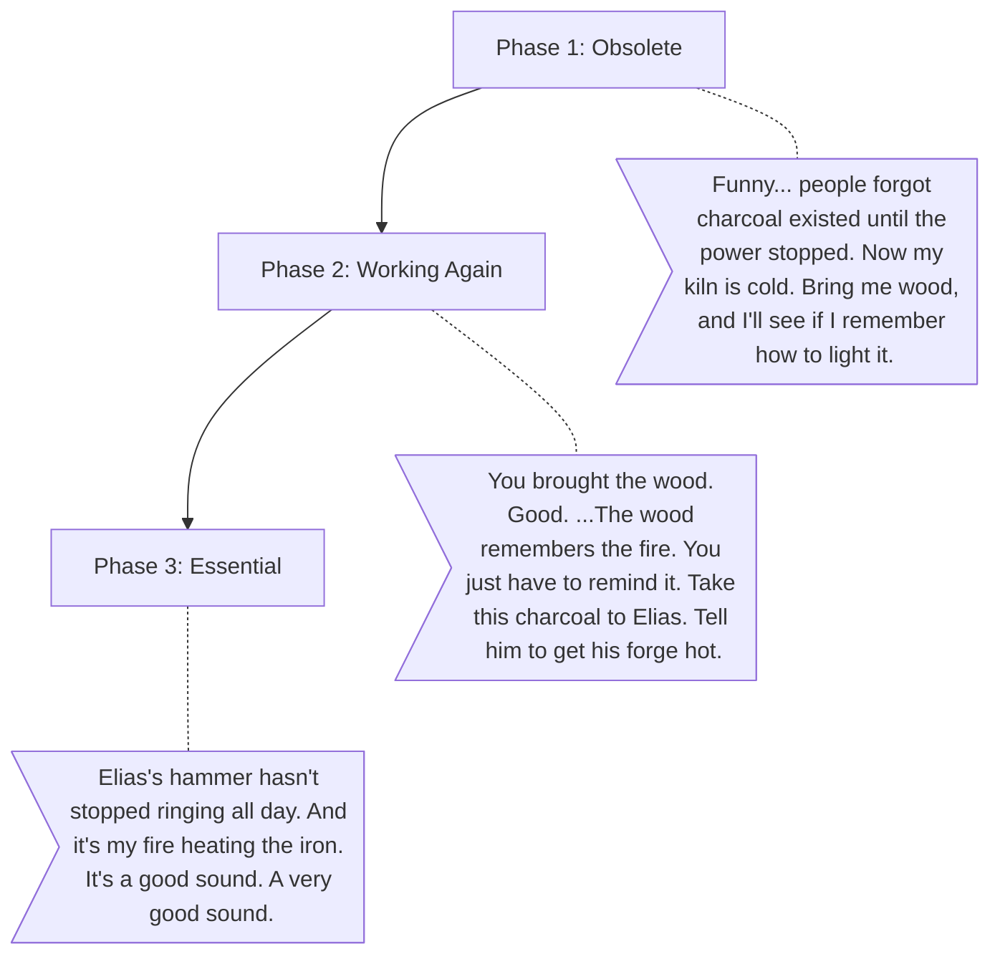

# Rowan (The Quiet Craftsman)

**The Wound:** He felt lost and obsolete when the factory took over, taking away the need for his charcoal.
**The Arc:** Returning to his old trade brings him a quiet, profound comfort as he realizes he is needed again.

## Dialogue Flow

