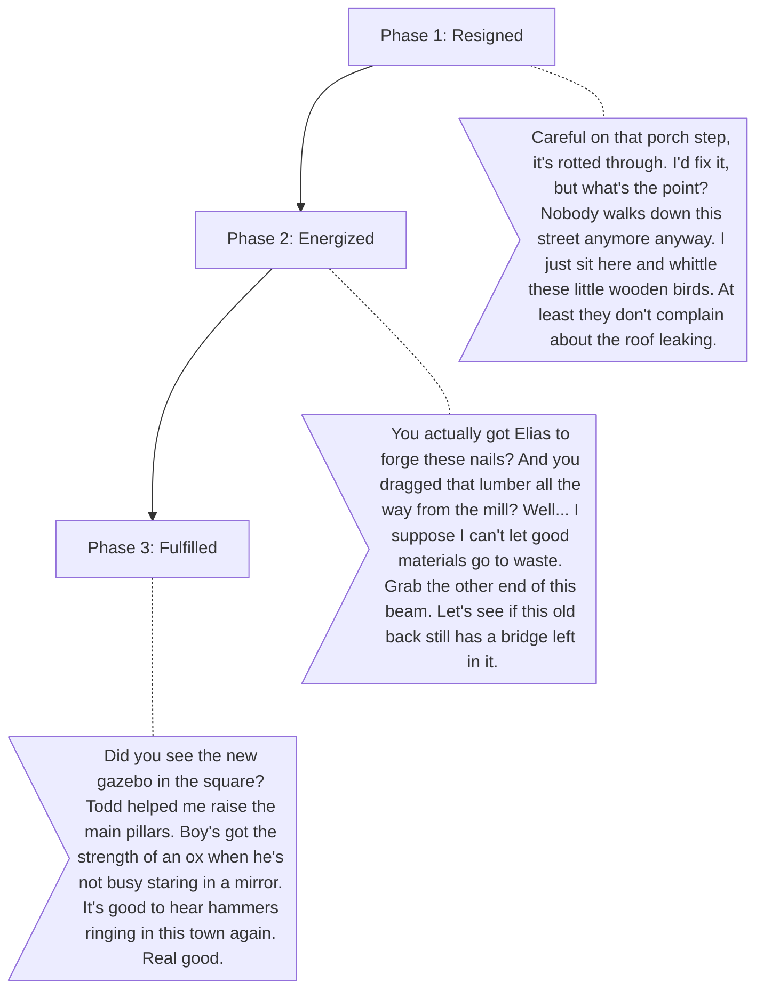

# Silas (The Carpenter)

**The Wound:** He is a master builder in a town that stopped growing. He feels useless because he has the skills to fix everything, but no materials and no one asking for his help. He spends his days whittling small trinkets instead of building homes.
**The Arc:** Moving from feeling obsolete to becoming the literal architect of the town's rebirth. He learns to ask for help instead of trying to do it all himself.

## Dialogue Flow

