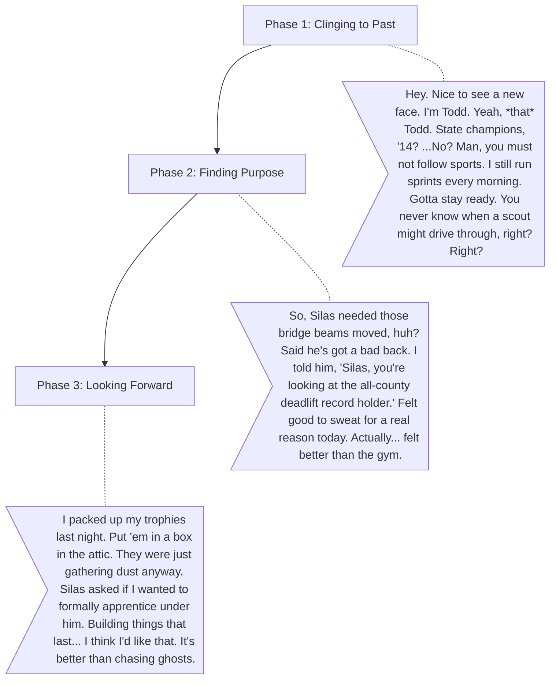

# Todd (The Former Star)

**The Wound:** He peaked in high school. He was the star athlete and the town's golden boy, but the factory closure and town decline left him without an audience or a clear path. He still wears his faded letterman jacket and constantly talks about "the glory days."
**The Arc:** Moving from living in the past to finding a practical, grounded purpose in the present. He learns to use his physical strength not for showing off, but for genuinely helping the community rebuild.

## Dialogue Flow

