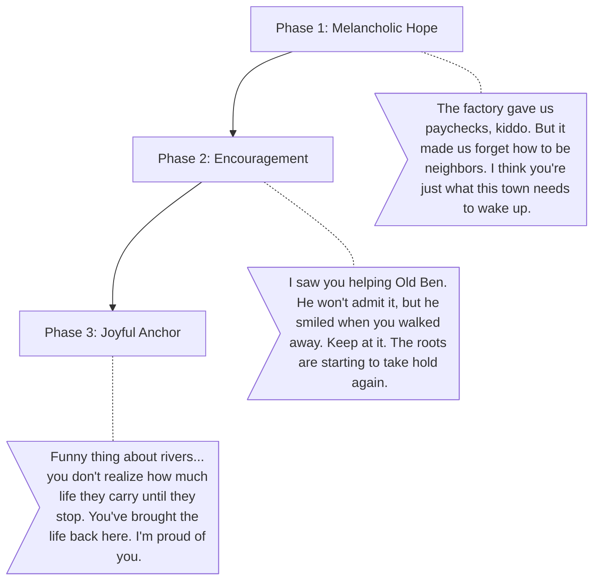

# Uncle Arthur (The Catalyst & Guide)

**The Wound:** He stayed behind when others left, watching the town slowly decay. He doesn't want to fix it himself because he knows true healing has to come from the community working together.
**The Arc:** Acting as the emotional anchor, watching the player rebuild what was lost.

## Dialogue Flow

